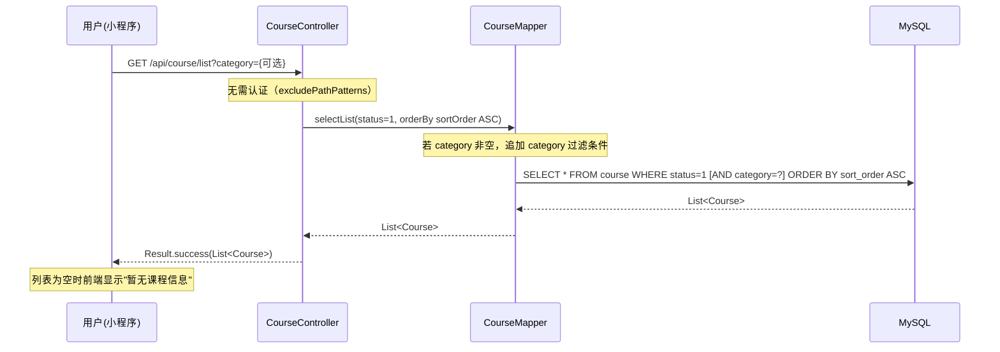
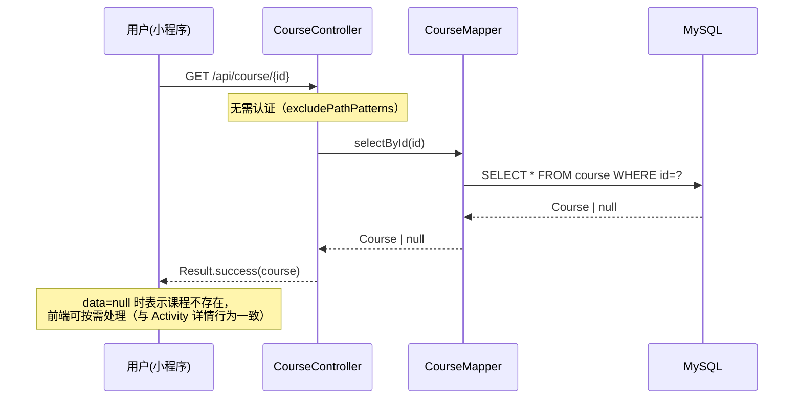
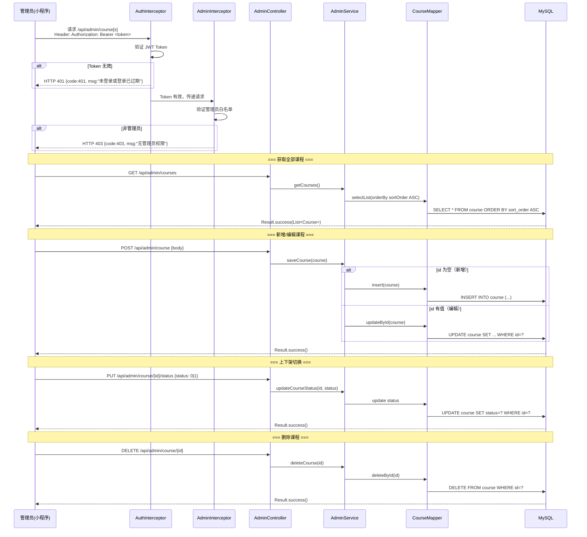
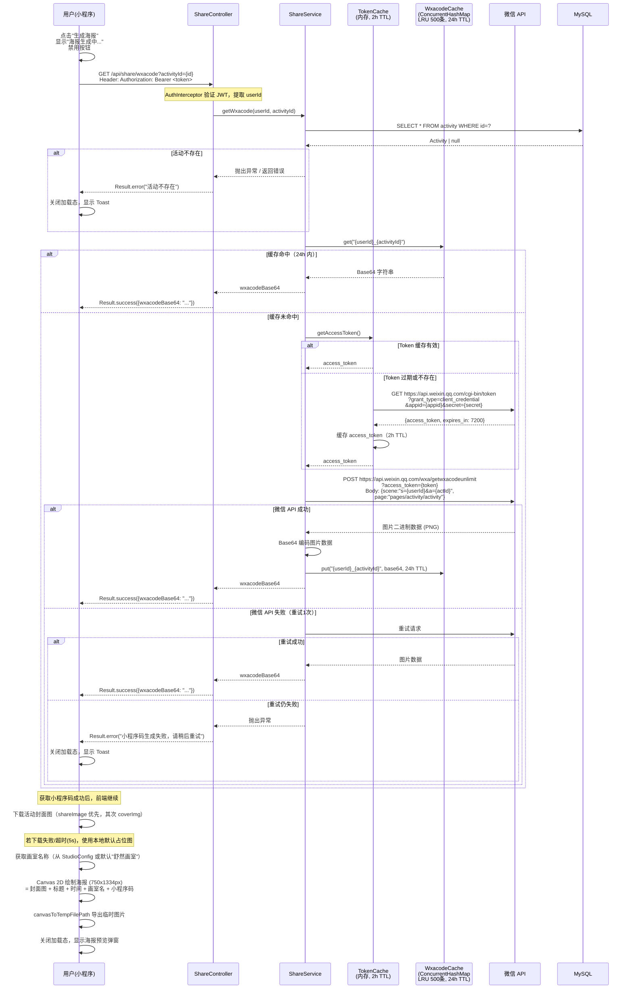
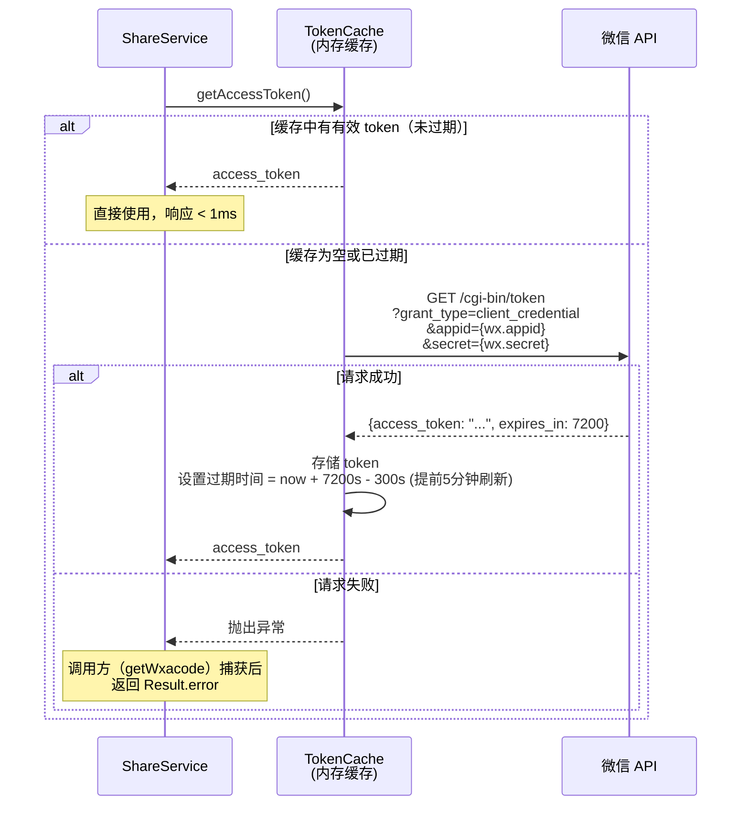
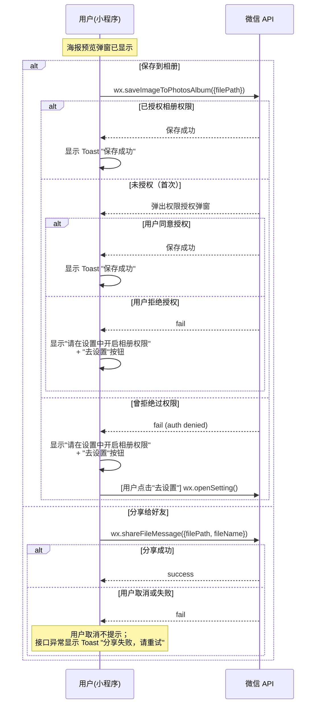
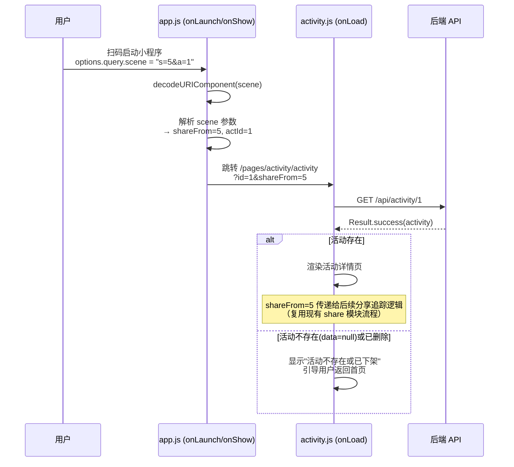

# 数据流 - CRS (课程管理) & PST (分享海报)

## 1. CRS 领域数据流

### 1.1 课程列表查询（用户端）

**触发**: 用户进入课程列表页，或在首页查看课程入口区域。

**需求来源**: EARS-CRS-001（课程列表）、EARS-CRS-002（分类筛选）、EARS-CRS-004（首页课程入口）



**首页课程入口变体**:
- 首页加载时调用 `GET /api/course/list`（不传 category）
- 前端取返回列表的前 4 项展示为缩略卡片
- 点击卡片或"查看更多"跳转到课程列表页

### 1.2 课程详情查询（用户端）

**触发**: 用户在课程列表中点击某个课程卡片。

**需求来源**: EARS-CRS-003（课程详情）



### 1.3 课程 CRUD（管理端）

**触发**: 管理员在管理后台对课程进行增删改查操作。

**需求来源**: EARS-CRS-005（管理后台 CRUD）



---

## 2. PST 领域数据流

### 2.1 海报生成流（主流程）

**触发**: 用户在活动详情页点击"生成海报"按钮。

**需求来源**: REQ-PST-001 ~ REQ-PST-004, REQ-PST-009 ~ REQ-PST-011, REQ-PST-014



### 2.2 access_token 管理流

**触发**: 后端首次调用微信服务端 API，或缓存的 access_token 过期。

**需求来源**: 决策 5（微信 access_token 管理）



**实现要点**（参照 `application.yml` 中 `wx.appid` / `wx.secret` 配置）:
- access_token 存储在内存变量中（单实例部署，无需 Redis）
- 过期时间设为微信返回的 `expires_in` 减去 300 秒（提前刷新，避免边界过期）
- 线程安全：使用 `synchronized` 或 `AtomicReference` 保护 token 读写

### 2.3 海报保存与分享

**触发**: 用户在海报预览弹窗中点击"保存到相册"或"分享给好友"。

**需求来源**: REQ-PST-005 ~ REQ-PST-008



### 2.4 扫码着陆流

**触发**: 用户扫描海报上的小程序码打开小程序。

**需求来源**: REQ-PST-012, REQ-PST-013



---

## 3. 跨领域交互

### 3.1 CRS 与首页的集成

```
首页(index.js)
  └─ onLoad()
       ├─ GET /api/activity/list       → 活动列表（已有）
       ├─ GET /api/studio/config       → 画室配置（已有）
       └─ GET /api/course/list         → 课程列表（新增，取前4项展示）
```

CRS 领域与首页的集成是纯粹的数据读取关系，无写入交互，无事务耦合。

### 3.2 PST 与 SHR（分享上下文）的关系

PST 的小程序码接口 `GET /api/share/wxacode` 挂载在 ShareController 下，属于分享上下文（决策 3）。PST 复用了：
- **ShareController** 的路由前缀 `/api/share`
- **ShareService** 中新增 `getWxacode` 方法
- **Activity 实体** 的 `shareImage`、`coverImg` 字段
- **StudioConfig** 的 `studio_name` 配置

PST 不直接写入 `share_record` 表，小程序码的 scene 参数中携带 `shareFrom`，扫码后的分享追踪由现有 SHR 流程处理。
